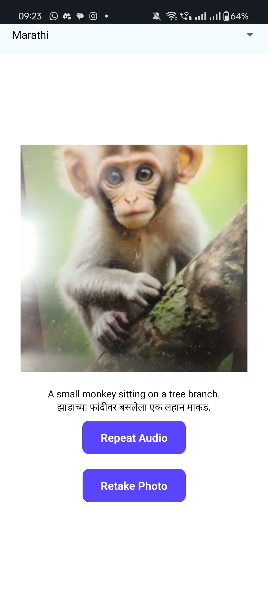
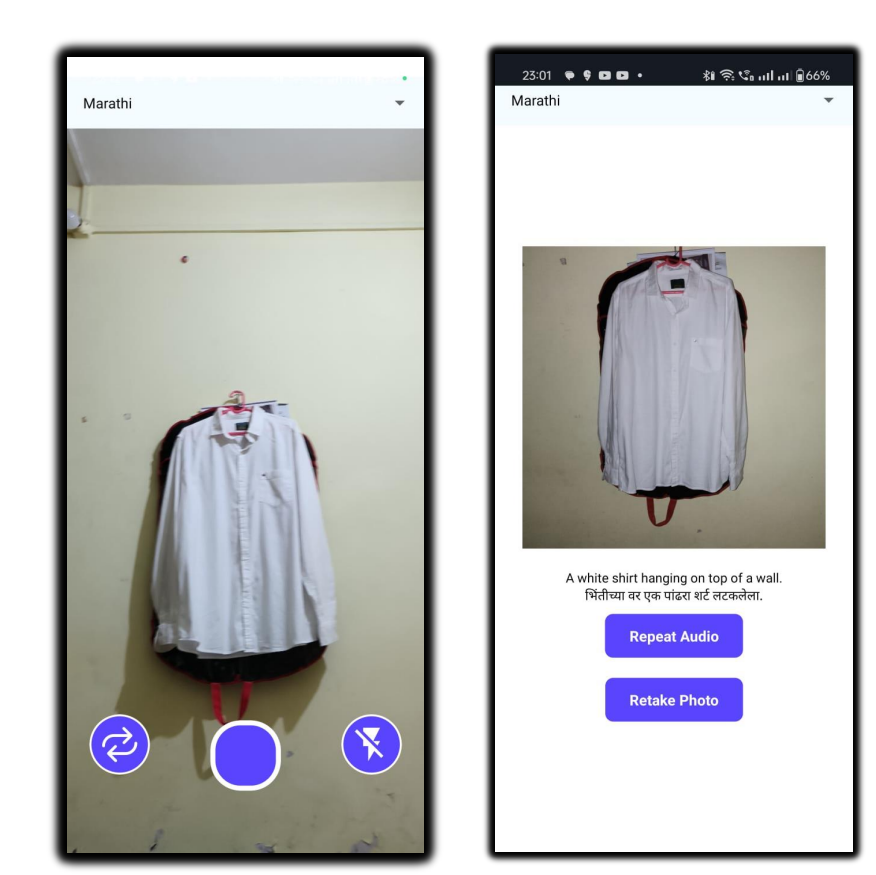

## Image Description for the Visually impaired multilingual approach

 This project aims at solving the challenge of Image captioning in Marathi Language. We aim to make a first of its kind marathi image captioning Model, previously such attempt was made by some students but in Kazakh language, so we are basically going to follow them in the approach. 
  
### Features:
- Multilingual Text to Speech support
-  Crisp & Contextual Image Descriptions – Generate precise and meaningful captions for images.
- Integration with Mobile Applications – Allow users to use the captioning model on Android apps.
- Multi-Modal AI Approach – Uses vision and language models together for better captioning.
### Images:

  
  

